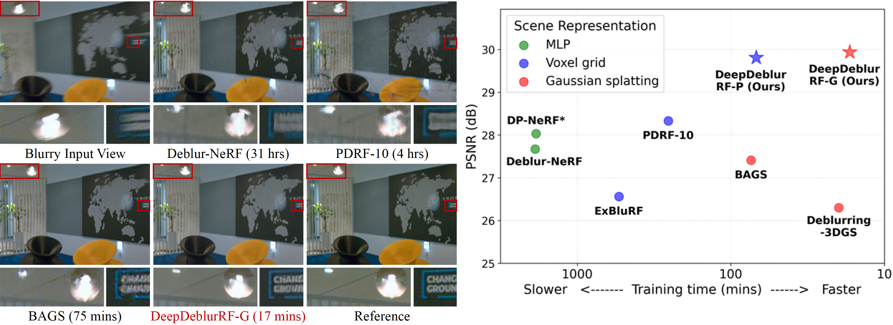

# [CVPR 2025] Exploiting Deblurring Networks for Radiance Fields (DeepDeblurRF) - Official PyTorch Implementation -

**Exploiting Deblurring Networks for Radiance Fields** 
[Haeyun Choi](https://haeyun-choi.github.io/), Heemin Yang, Janghyuk Han, Sunghyun Cho 
POSTECH

## Abstract
*In this paper, we propose DeepDeblurRF, a novel radiance field deblurring approach that can synthesize high-quality novel views from blurred training views with significantly reduced training time. DeepDeblurRF leverages deep neural network (DNN)-based deblurring modules to enjoy their deblurring performance and computational efficiency. To effectively combine DNN-based deblurring and radiance field construction, we propose a novel radiance field (RF)-guided deblurring and an iterative framework that performs RF-guided deblurring and radiance field construction in an alternating manner. Moreover, DeepDeblurRF is compatible with various scene representations, such as voxel grids and 3D Gaussians, expanding its applicability. We also present BlurRF-Synth, the first large-scale synthetic dataset for training radiance field deblurring frameworks. We conduct extensive experiments on both camera motion blur and defocus blur, demonstrating that DeepDeblurRF achieves state-of-the-art novel-view synthesis quality with significantly reduced training time.*

## News
* Code & dataset will be released soon
