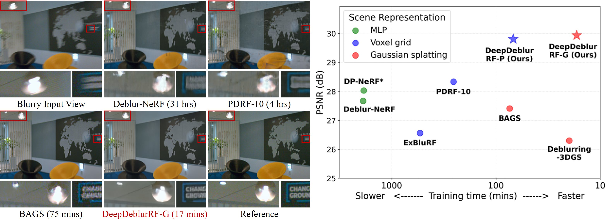

# [CVPR 2025] Exploiting Deblurring Networks for Radiance Fields (DeepDeblurRF)<br><sub>- Official PyTorch Implementation -</sub>  
*Fast and high-quality novel-view synthesis from blurry images using iterative deblurring and radiance field construction.*

[](https://haeyun-choi.github.io/DDRF_page/)
[](https://arxiv.org/abs/2502.14454)
[](https://drive.google.com/drive/folders/12t5J8VW102c2eXuj90RY9nVw5Uyv2YQ8)
[](https://youtu.be/1RktYghRXzU)

**Exploiting Deblurring Networks for Radiance Fields**  
Haeyun Choi, Heemin Yang, Janghyuk Han, Sunghyun Cho  
KT, POSTECH

## Overview


## Abstract
*In this paper, we propose DeepDeblurRF, a novel radiance field deblurring approach that can synthesize high-quality novel views from blurred training views with significantly reduced training time. DeepDeblurRF leverages deep neural network (DNN)-based deblurring modules to enjoy their deblurring performance and computational efficiency. To effectively combine DNN-based deblurring and radiance field construction, we propose a novel radiance field (RF)-guided deblurring and an iterative framework that performs RF-guided deblurring and radiance field construction in an alternating manner. Moreover, DeepDeblurRF is compatible with various scene representations, such as voxel grids and 3D Gaussians, expanding its applicability. We also present BlurRF-Synth, the first large-scale synthetic dataset for training radiance field deblurring frameworks. We conduct extensive experiments on both camera motion blur and defocus blur, demonstrating that DeepDeblurRF achieves state-of-the-art novel-view synthesis quality with significantly reduced training time.*

## News  
[May 3, 2025] Train dataset released 🚀  
[May 2, 2025] Test code and pretrained model weights are now available ✅  
[Apr 2, 2025] Test dataset released 🚀  
[Feb 27, 2025] Code & dataset will be released soon  
[Feb 26, 2025] Our paper has been accepted to CVPR 2025! 🎉

## Getting Started

### 0. Install requirements

Clone the repository and set up the environment:

```bash
salloc -N 1 -n 1 --gres=gpu:1 --nodelist=n1
srun --pty bash  

git clone https://github.com/suNoeul/DeepDeblurRF.git
cd DeepDeblurRF

conda create -n ddrf python=3.8
conda activate ddrf

# Adjust the CUDA version according to your environment.  
# See: https://pytorch.org/get-started/locally/
# Example for CUDA 11.6:
pip install torch==1.12.1+cu116 torchvision==0.13.1+cu116 torchaudio==0.12.1 -f https://download.pytorch.org/whl/cu116/torch_stable.html  
pip install -r requirements.txt
```

Build external components: 

```bash
# NAFNet
cd NAFNet/
python setup.py develop --no_cuda_ext
cd ..

# Gaussian Splatting submodules
cd gaussian-splatting
pip install ./submodules/diff-gaussian-rasterization
pip install ./submodules/simple-knn
cd ..

# LLFF
git submodule update --init --recursive
# Replace COLMAP wrapper with custom version
cp ./colmap_wrapper.py ./LLFF/llff/poses/colmap_wrapper.py
```

### 1. Download pretrained weights

Download all pretrained weights for the deblurring networks from the following link:

[Google Drive - weights](https://drive.google.com/drive/folders/16QBdHTkZ7xUm2zqeBtLFNZaSD1Qx1h-R?usp=sharing)

Place them in:
```
DeepDeblurRF/NAFNet/weights/
  └── DDRF_G
      ├── defocus
      ├── defocus_dbnerf_real
      ├── motion
      └── motion_dbnerf_real
```

### 2. Prepare your test data

Place your scene folder inside `data/`, e.g.:

```
data/blurball/
├── blur/                  # blurry input images
├── nv/                    # sharp images (for NVS testing)
├── hold=<k>               # NVS split (e.g., 1 every k frames)
```

For example, if you have 27 images (`000.png` to `026.png`) and `hold=7`,  
then the held-out indices for NVS testing will be:

```
nv/ = [000.png, 007.png, 014.png, 021.png]
blur/ = all other images
```


### 3. Run preprocessing

The preprocessing step creates the **initial deblurred dataset** (`D₀`) and prepares the Radiance Field (RF) input directory.

**Mode requirement:**  
This mode change is necessary because the NAFNet codebase has **two different `basicsr` implementations**:
  - **SD mode** (`basicsr` + `basicsr_RF` exists) → Used for standalone deblurring (D₀).
  - **RF mode** (`basicsr` + `basicsr_SD` exists) → Used for RF-guided deblurring during DDRF iterations.

You can switch modes using:
```bash
python switch_basicsr.py --mode sd  # Activate SD mode for D₀ generation
python switch_basicsr.py --mode rf  # Activate RF mode for DDRF pipeline
```
<summary><strong>Open and run <code>preprocessing.ipynb</code>.</strong></summary>

It performs:

- Initial deblurring with NAFNet_SD → `deblur/deblur_0/`
- Radiance field setup → `rf/rf_0/images/`

<br>

<details> <summary><strong>Option: CLI alternative (<code>prepare_dataset.py</code>)</strong></summary>
If you cannot use the Jupyter notebook, you can perform the same preprocessing from the command line.

This script will:
- Ensure SD mode is active (switch if necessary).
- Generate deblur/deblur_0/ from blur/ (incremental by default).
- Populate rf/rf_0/images/ with both deblur_0 and nv/.
- Copy hold=<k> into rf/rf_0/.

**Usage (incremental default):**
```bash
python switch_basicsr.py --mode sd
python prepare_dataset.py \
    --scene_name blurball \
    --scene_type motion_dbnerf_real
```

After running preprocessing in SD mode, remember to switch to RF mode before executing:

```bash
python switch_basicsr.py --mode rf
python ddrf.py -c configs/<data_type>/<blur_type>/<scene_name>.txt
```
</details> 

<br>
Expected result structure:

```
data/cozyroom/
├── blur/      # before preprocessing
├── nv/        # before preprocessing
├── hold=<k>   # before preprocessing
├── deblur/
│   └── deblur_0/
├── rf/
│   └── rf_0/
│       └── images/
│       └── hold=<k>
```
</details>

### 4. Run the DeepDeblurRF pipeline

Choose the appropriate config file based on your dataset:

```
configs/
├── blurrf_synth/
│   ├── motion/
│   └── defocus/
├── blurrf_real/
├── dbnerf_real/
│   ├── motion/
│   └── defocus/
```

Example:
```bash
python ddrf.py -c configs/dbnerf_real/motion/blurball.txt
```

This will run the full iterative training and deblurring pipeline.

Final novel-view synthesis results will be saved in:
```
data/<scene_name>/Final_results/
```

## Iterative Pipeline Structure in DeepDeblurRF

DeepDeblurRF is built as an iterative pipeline that progressively refines novel-view synthesis from blurry inputs. Each iteration consists of radiance field (RF) construction and RF-guided deblurring. 

The structure below summarizes the process:

| Iteration (`index`) | RF Input Folder | Rendered Views (train/test) | NAFNet Settings           | RF-Guided Deblur Output | Final Output         |
|---------------------|------------------|-------------------------------|----------------------------|--------------------------|-----------------------|
| 1                   | `rf_0`           | `trviews_1`, `tsviews_1`     | `NAFNet-width64_1.yml`     | `deblur_1`               | ❌                    |
| 2                   | `rf_1`           | `trviews_2`, `tsviews_2`     | `NAFNet-width64_2.yml`     | `deblur_2`               | ❌                    |
| 3                   | `rf_2`           | `trviews_3`, `tsviews_3`     | `NAFNet-width64_3.yml`     | `deblur_3`               | ❌                    |
| 4                   | `rf_3`           | `trviews_4`, `tsviews_4`     | `NAFNet-width64_4.yml`     | `deblur_4`               | ❌                    |
| 5                   | `rf_4`           | `trviews_5`, `tsviews_5`     | *(skipped)*                | *(not created)*          | ✅ `tsviews_5`         |

- Iteration starts from `index = 1`. Each RF input `rf_{index-1}` is constructed from `deblur_{index-1}` and novel views (`nv`).
- The initial deblur input `deblur_0` is generated beforehand via `preprocess.ipynb`.
- Rendered views `trviews_{index}` and `tsviews_{index}` are generated from the trained RF.
- RF-guided deblurring is applied using the original `blur` images and the rendered `trviews_{index}`, producing `deblur_{index}`.
- NAFNet weights (`NAFNet-width64_k.yml`) change per iteration (up to 4 models).
- On the final iteration (`index = 5`), deblurring is skipped and `tsviews_5` is considered the final output.

Final results are saved in:
```
data/<scene_name>/Final_results/
```

Example:
```
data/cozyroom/Final_results/
```

**Note:** The 3D Gaussian splatting can be replaced with other RF representations (e.g., voxel grids, NeRF). 


## Dataset

Training the deblurring modules of our framework requires a large-scale dataset of blurred images paired with ground-truth sharp images.  

### BlurRF-Synth

- The **first large-scale multi-view dataset** for radiance field deblurring
- Contains 4,350 blurred-sharp image pairs across 150 scenes
  - 2,175 pairs for camera motion blur
  - 2,175 pairs for defocus blur
- Simulates real-world degradations: camera noise, saturated pixels, nonlinear ISP artifacts

### BlurRF-Real

- A small real-world dataset captured under challenging conditions
- 5 indoor scenes with camera motion blur, low-light, and high noise
- Captured using a machine vision camera for realistic evaluation

#### Download the datasets:
- [BlurRF Datasets](https://drive.google.com/drive/folders/12t5J8VW102c2eXuj90RY9nVw5Uyv2YQ8)


## Acknowledgements

This project builds upon the following works. We thank the authors for open-sourcing their excellent codebases:

- [LLFF: Local Light Field Fusion (SIGGRAPH 2019)](https://github.com/Fyusion/LLFF)
- [NAFNet (ECCV 2022)](https://github.com/megvii-research/NAFNet)
- [Plenoxels (CVPR 2022)](https://github.com/sxyu/svox2)
- [3D Gaussian Splatting (SIGGRAPH 2023)](https://github.com/graphdeco-inria/gaussian-splatting)
- [Deblurring 3D Gaussian Splatting (ECCV 2024)](https://github.com/benhenryL/Deblurring-3D-Gaussian-Splatting)

## Citation

If you find this work useful for your research, please consider citing:

```bibtex
@InProceedings{Choi_2025_CVPR,
    author    = {Choi, Haeyun and Yang, Heemin and Han, Janghyeok and Cho, Sunghyun},
    title     = {Exploiting Deblurring Networks for Radiance Fields},
    booktitle = {Proceedings of the Computer Vision and Pattern Recognition Conference (CVPR)},
    month     = {June},
    year      = {2025},
    pages     = {6012-6021}
}
```
